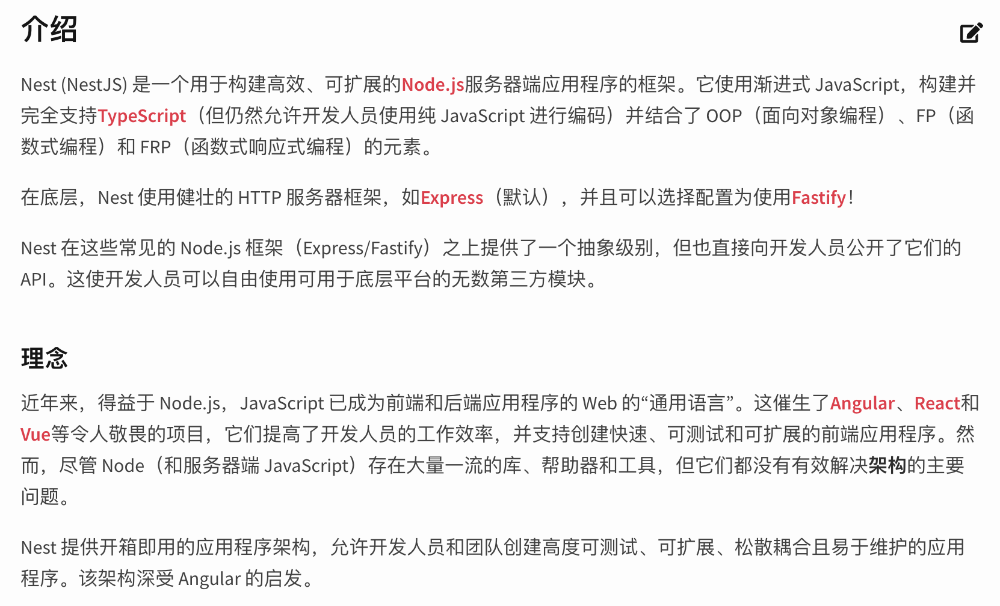
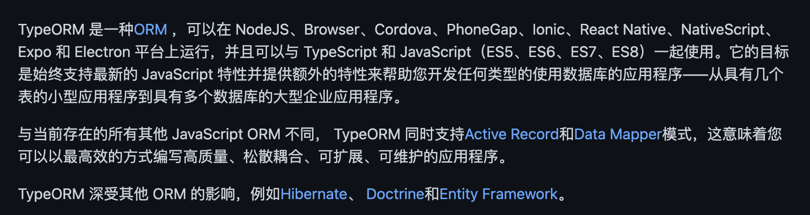
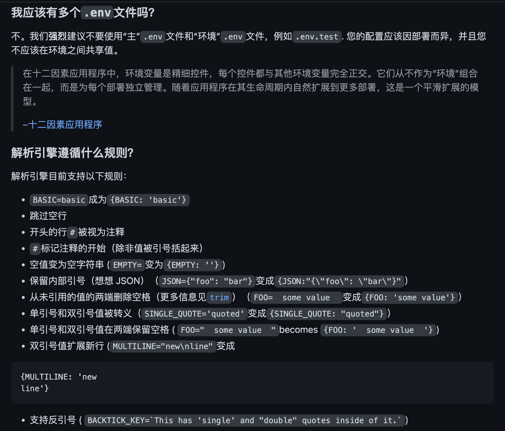

# {{ $frontmatter.title }}

[[toc]]

## 技术栈

- [nest.js](https://docs.nestjs.com/)
- [typeOrm](https://github.com/typeorm/typeorm)





### env 配置

• [https://docs.nestjs.com/techniques/configuration#configuration](https://docs.nestjs.com/techniques/configuration#configuration)



```sh
# 生成 .env 文件
cp .env.example .env
```

参考最佳实践：

> best practice is to store configuration variables in the environment.

### DB-Transaction 事务

• [https://typeorm.io/transactions](https://typeorm.io/transactions)
  • [#creating-and-using-transactions](https//typeorm.io/transactions#creating-and-using-transactions)  官方的文档和 example 内容太简单。
  • [#using-queryrunner-to-create-and-control-state-of-single-database-connection](https://typeorm.io/transactions#using-queryrunner-to-create-and-control-state-of-single-database-connection)

**推荐：dataSource.transaction**

transaction 源码:

```ts
/**
 * Wraps given function execution (and all operations made there) in a transaction.
 * All database operations must be executed using provided entity manager.
 */
async transaction(isolationOrRunInTransaction, runInTransactionParam) {
    const isolation = typeof isolationOrRunInTransaction === "string"
        ? isolationOrRunInTransaction
        : undefined;
    const runInTransaction = typeof isolationOrRunInTransaction === "function"
        ? isolationOrRunInTransaction
        : runInTransactionParam;
    if (!runInTransaction) {
        throw new error_1.TypeORMError(`Transaction method requires callback in second parameter if isolation level is supplied.`);
    }
    if (this.queryRunner && this.queryRunner.isReleased)
        throw new QueryRunnerProviderAlreadyReleasedError_1.QueryRunnerProviderAlreadyReleasedError();
    // if query runner is already defined in this class, it means this entity manager was already created for a single connection
    // if its not defined we create a new query runner - single connection where we'll execute all our operations
    const queryRunner = this.queryRunner || this.connection.createQueryRunner();
    try {
        await queryRunner.startTransaction(isolation);
        const result = await runInTransaction(queryRunner.manager);
        await queryRunner.commitTransaction();
        return result;
    }
    catch (err) {
        try {
            // we throw original error even if rollback thrown an error
            await queryRunner.rollbackTransaction();
        }
        catch (rollbackError) { }
        throw err;
    }
    finally {
        if (!this.queryRunner)
            // if we used a new query runner provider then release it
            await queryRunner.release();
    }
}
```

从源码可以可以看出 `transaction` 函数内部已封装了 `queryRunner` 相关的 `startTransaction`、`commitTransaction`、`rollbackTransaction`、`release` 等操作。

Everything you want to run in a transaction must be executed in a callback:

```ts
await myDataSource.manager.transaction(async (transactionalEntityManager) => {
    await transactionalEntityManager.save(users)
    await transactionalEntityManager.save(photos)
    // ...
})
```

The most important restriction when working in a transaction is to **ALWAYS** use the provided instance of entity manager - transactionalEntityManager in this example. **DO NOT USE GLOBAL ENTITY MANAGER**. *All operations MUST be executed using the provided transactional entity manager*.

**demo**

```ts
import { Injectable, Logger } from '@nestjs/common';
import { DataSource } from 'typeorm';
import { OnesUsers } from "@app/modules/slack/entity/ones-users.entity";

@Injectable()
export class UserService {
  private readonly logger = new Logger(UserService.name);

  constructor(
    private dataSource: DataSource,
  ) {}

  async newAction() {
    return await this.dataSource.transaction(async (entityManager) => {
        const onesUser = entityManager.getRepository(OnesUsers)
        
        const users = await onesUser.save({
          appUserId: 'appUserId' + Math.random(),
          onesUserId: 'onesUserId' + Math.random(),
          accessToken: 'accessToken' + Math.random(),
          email: 'email'
        })
        this.logger.log('%o', users)

        // throw Error('123')
        return await onesUser.find()
      })
  }
}
```

### favicon.ico

- 参考文档 [#Serve Static](https://docs.nestjs.com/recipes/serve-static)

### 日志

推荐使用

- [winston](https://github.com/winstonjs/winston) recommended
- [nestjs-pino](https://www.npmjs.com/package/nestjs-pino)
